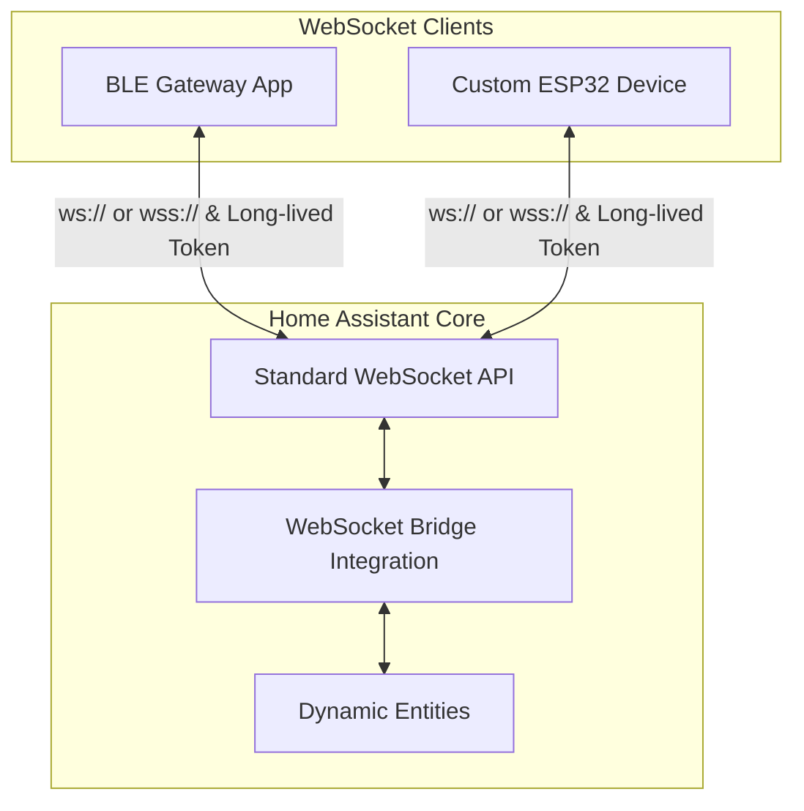

# WebSocket Bridge (`ws_bridge`) for Home Assistant

A generic Home Assistant integration that enables **any authenticated WebSocket client** to dynamically create and update entities. It is fully decoupled from specific hardware or protocols (e.g., BLE, Zigbee); as long as the client conforms to the defined communication protocol, it works out of the box.

## 💬 Feedback & Support

🐞 Found a bug? Let us know via an [Issue](https://github.com/eigger/hass-ws-bridge/issues).  
💡 Have a question or suggestion? Join the [Discussion](https://github.com/eigger/hass-ws-bridge/discussions)!

---

## 🚀 Key Features

- **No Additional Brokers/Ports**: Communicates directly using Home Assistant's standard WebSocket API (`/api/websocket`) and a Long-Lived Access Token. No need to run an MQTT broker or expose extra TCP ports.
- **Dynamic Entity Provisioning**: Entities are created instantly in Home Assistant as soon as the client declares them via JSON messages over the WebSocket connection.
- **Client-based Device Grouping**: Each client (identified by `gateway_id`) is registered as a parent device (Gateway) in Home Assistant. All devices/entities declared by that client are grouped as child devices (`via_device`) under it for clean organization.
- **Bi-directional Command Routing**: Supports control components including `switch`, `number`, `select`, and `button`. Control events (`command`) triggered by the HA UI or automations are routed back exclusively to the originating client.
- **Connection State Tracking (LWT)**: If the client's WebSocket connection drops, all child devices and entities registered by that client are automatically set to `unavailable` to prevent stale states.

---

## 📐 Architecture Flow

---

## 🛠️ Supported Entity Platforms

| Platform | Direction | Description / Supported Attributes |
|:---|:---:|:---|
| `sensor` | Read | Numerical state data (`unit_of_measurement`, `device_class`, `state_class`) |
| `binary_sensor` | Read | On/Off boolean states (`device_class`) |
| `switch` | Control | Power toggle control (`turn_on`, `turn_off`) |
| `number` | Control | Range value control (`set_value`, `min`, `max`, `step`) |
| `select` | Control | Option selection control (`select_option`, `options`) |
| `button` | Control | Execution trigger (`press`, stateless) |

---

## 💾 Installation

### Method 1: Via HACS (Recommended)
1. Navigate to **HACS** in your Home Assistant sidebar.
2. Click the three dots in the top right corner and select **Custom repositories**.
3. Enter `https://github.com/eigger/hass-ws-bridge` as the repository URL, set the category to **Integration**, and click **Add**.
4. Install the integration, then **restart Home Assistant**.

### Method 2: Manual Installation
1. Download the `custom_components/ws_bridge` folder from this repository.
2. Copy it into your Home Assistant configuration directory under `custom_components/`.
   * Target path: `config/custom_components/ws_bridge/`
3. **Restart Home Assistant**.

---

## ⚙️ Configuration & Setup

1. **Add Integration in HA**:
   * Navigate to **Settings** -> **Devices & Services** -> **Add Integration**.
   * Search for **WebSocket Bridge** and add it. (It will initialize instantly without requiring any UI configuration.)
2. **Generate Long-Lived Access Token**:
   * Go to your Home Assistant user profile page, scroll to the bottom, and click **Create Token**. Copy the token value.
3. **Configure Client**:
   * Enter the Home Assistant WebSocket URL (e.g., `ws://192.168.1.100:8123/api/websocket`) and the generated token in your client application/device.

---

## 📄 Protocol Specification

For the detailed JSON message formats exchanged between clients and the bridge, see:
- 🇺🇸 **[English Protocol Specification (docs/PROTOCOL.md)](docs/PROTOCOL.md)**
- 🇰🇷 **[Korean Protocol Specification (docs/PROTOCOL_ko.md)](docs/PROTOCOL_ko.md)**

### Message Summary:
* **Session Registration**: `{"type": "ws_bridge/connect", "gateway_id": "..."}`
* **Entity Declaration**: `{"type": "ws_bridge/entity", "unique_id": "...", "platform": "sensor", ...}`
* **State Update**: `{"type": "ws_bridge/state", "states": [{"unique_id": "...", "value": 25.4}]}`
* **Device Availability**: `{"type": "ws_bridge/availability", "device_id": "...", "online": true}`
* **Control Event**: HA pushes `{"kind": "command", "unique_id": "...", "action": "turn_on"}` events to the client.

---

## 📄 License
This project is licensed under the MIT License - see the LICENSE file for details.
