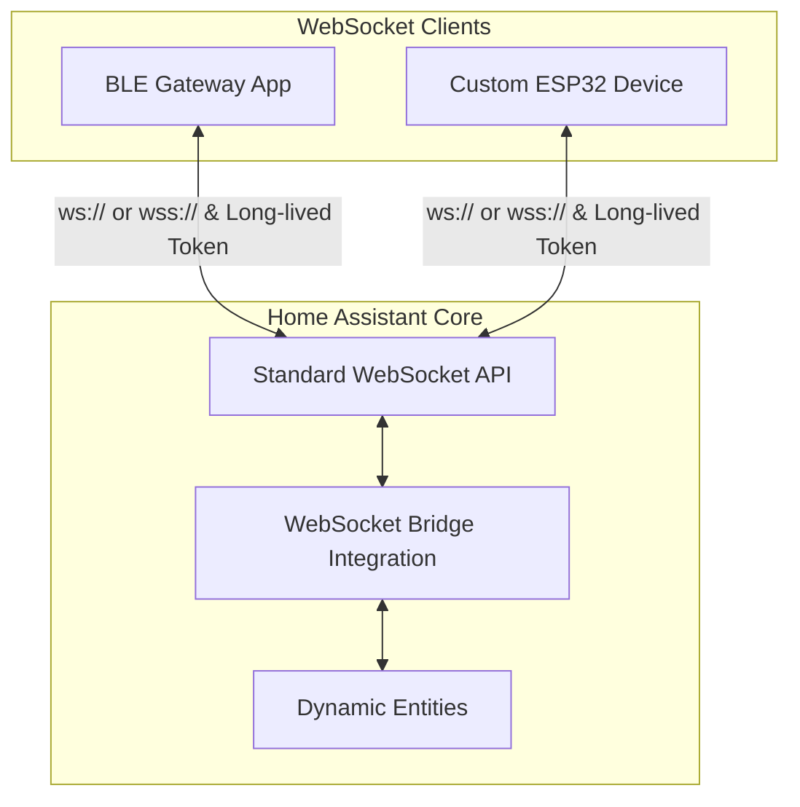

# WebSocket Bridge (`ws_bridge`) for Home Assistant

인증된 **WebSocket 클라이언트**가 엔티티를 동적으로 생성·갱신할 수 있게 해 주는 범용 Home Assistant 통합구성요소입니다. BLE, Zigbee 등 특정 하드웨어나 프로토콜에 묶이지 않으며, 정의된 통신 규약만 따르면 바로 사용할 수 있습니다.

## 💬 피드백 및 지원

🐞 버그를 발견하셨나요? [Issue](https://github.com/eigger/hass-ws-bridge/issues)로 알려 주세요.  
💡 질문이나 제안이 있으신가요? [Discussion](https://github.com/eigger/hass-ws-bridge/discussions)에 참여해 주세요!

---

## 🚀 주요 기능

- **추가 브로커/포트 불필요**: Home Assistant 표준 WebSocket API(`/api/websocket`)와 장기 액세스 토큰만 사용합니다. MQTT 브로커를 따로 띄우거나 TCP 포트를 추가로 열 필요가 없습니다.
- **동적 엔티티 생성**: 클라이언트가 WebSocket으로 JSON 메시지로 엔티티를 선언하면 Home Assistant에 즉시 생성됩니다.
- **클라이언트 기반 장치 그룹화**: 각 클라이언트(`gateway_id`)는 HA에 게이트웨이(부모) 디바이스로 등록되고, 해당 클라이언트가 선언한 장치·엔티티는 `via_device`로 하위에 묶입니다.
- **양방향 제어 라우팅**: `switch`, `number`, `select`, `button` 제어 이벤트(`command`)를 HA UI·자동화에서 발생시키면, 해당 엔티티를 등록한 클라이언트에만 전달합니다.
- **연결 상태 추적(LWT)**: 클라이언트 WebSocket 연결이 끊기면, 그 클라이언트가 등록한 하위 장치·엔티티가 자동으로 `unavailable`이 됩니다.
- **연결 클라이언트 수 진단 센서**: 현재 WebSocket으로 연결된 클라이언트(`gateway_id`) 수를 실시간으로 표시하는 진단 센서를 제공합니다.

---

## 📐 아키텍처

---

## 🛠️ 지원 엔티티 플랫폼

| 플랫폼 | 방향 | 설명 / 지원 속성 |
|:---|:---:|:---|
| `sensor` | 읽기 | 수치 상태 (`unit_of_measurement`, `device_class`, `state_class`) |
| `binary_sensor` | 읽기 | On/Off 불리언 상태 (`device_class`) |
| `switch` | 제어 | 전원 토글 (`turn_on`, `turn_off`) |
| `number` | 제어 | 범위 값 제어 (`set_value`, `min`, `max`, `step`) |
| `select` | 제어 | 옵션 선택 (`select_option`, `options`) |
| `button` | 제어 | 실행 트리거 (`press`, 상태 없음) |

---

## 💾 설치

### 방법 1: HACS (권장)
1. Home Assistant 사이드바에서 **HACS**로 이동합니다.
2. 우측 상단 점 세 개 → **사용자 지정 리포지토리**를 선택합니다.
3. 리포지토리 URL에 `https://github.com/eigger/hass-ws-bridge`를 입력하고, 카테고리를 **Integration**으로 설정한 뒤 **추가**합니다.
4. 통합구성요소를 설치한 후 **Home Assistant를 재시작**합니다.

### 방법 2: 수동 설치
1. 이 리포지토리에서 `custom_components/ws_bridge` 폴더를 받습니다.
2. Home Assistant 설정 디렉터리의 `custom_components/` 아래에 복사합니다.
   * 대상 경로: `config/custom_components/ws_bridge/`
3. **Home Assistant를 재시작**합니다.

---

## ⚙️ 설정

1. **HA에 통합구성요소 추가**
   * **설정** → **디바이스 및 서비스** → **통합구성요소 추가**
   * **WebSocket Bridge**를 검색해 추가합니다. (추가 UI 설정 없이 바로 초기화됩니다.)
2. **장기 액세스 토큰 발급**
   * Home Assistant 사용자 프로필 페이지 하단의 **토큰 생성**을 눌러 토큰을 복사합니다.
3. **클라이언트 설정**
   * 클라이언트 앱/장치에 Home Assistant WebSocket URL(예: `ws://192.168.1.100:8123/api/websocket`)과 발급한 토큰을 입력합니다.

---

## 📄 프로토콜 규격

클라이언트와 브릿지 간 JSON 메시지 형식은 아래 문서를 참고하세요.
- 🇺🇸 **[영문 프로토콜 규격 (docs/PROTOCOL.md)](docs/PROTOCOL.md)**
- 🇰🇷 **[한글 프로토콜 규격 (docs/PROTOCOL_ko.md)](docs/PROTOCOL_ko.md)**

### 메시지 요약
* **세션 등록**: `{"type": "ws_bridge/connect", "gateway_id": "..."}`
* **엔티티 선언**: `{"type": "ws_bridge/entity", "unique_id": "...", "platform": "sensor", ...}`
* **상태 갱신**: `{"type": "ws_bridge/state", "states": [{"unique_id": "...", "value": 25.4}]}`
* **장치 가용성**: `{"type": "ws_bridge/availability", "device_id": "...", "online": true}`
* **삭제**: `{"type": "ws_bridge/remove", "unique_id": "..."}` / `{"device_id": "..."}` / `{}` (게이트웨이 전체)
* **제어 이벤트**: HA가 클라이언트에 `{"kind": "command", "unique_id": "...", "action": "turn_on"}` 형태로 push합니다.

> **중요**: `auth_ok`를 받기 전에는 `ws_bridge/*` 메시지를 보내지 마세요. 반드시 `auth` → `ws_bridge/connect` → `ws_bridge/entity` 순서를 지킵니다.

---

## 📄 라이선스
이 프로젝트는 MIT License 하에 배포됩니다. 자세한 내용은 LICENSE 파일을 참고하세요.
